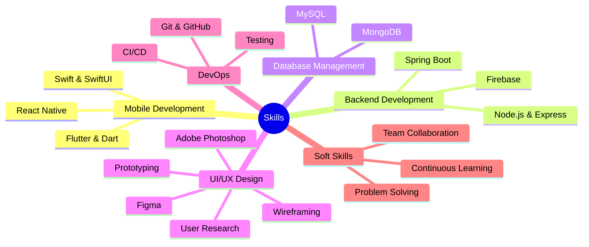

<div align="center">
  


### `Mobile Developer` | `UI/UX Designer` | `Full Stack Engineer`

[](https://github.com/chamudithaperera)

</div>

<br>

<div align="center">
  
  <a href="mailto:chamudithaperera.dev@gmail.com">
    
  </a>
  <a href="https://linkedin.com/in/chamudithakavishan">
    
  </a>
  <a href="https://github.com/chamudithaperera">
    
  </a>
  <a href="https://stackoverflow.com/users/23240553/chamuditha-perera">
    
  </a>
  <a href="https://www.buymeacoffee.com/chamudithaperera">
    
  </a>
  
</div>

<!-- About Me Section -->
##  About Me

<div align="center">
  
</div>

```txt
─────────────────────────────────────────────────────────────────────────
Mobile developer with a passion for creating intuitive, user-centered apps
that seamlessly blend elegant code with beautiful design. Based in Sri Lanka,
I specialize in Swift and Flutter while pursuing my IT degree.
─────────────────────────────────────────────────────────────────────────
```

> 🚀 **Transforming Ideas into Exceptional Digital Experiences**

### What Drives Me

- **User-Centered Design** - Creating interfaces that are intuitive and delightful
- **Clean Architecture** - Building scalable applications with maintainable code
- **Continuous Learning** - Always exploring new technologies and methodologies

### Currently Working On

- 📱 Advanced SwiftUI animation patterns 
- 💡 Flutter state management with Riverpod
- 🔍 Mobile UI motion design and micro-interactions

<!-- Tech Stack Section -->
##  Tech Stack

<div align="center">

### Main Technologies

[](#)
[](#) 
[](#)
[](#)
[](#)
[](#)

### Backend & Databases

[](#)
[](#)
[](#)
[](#)
[](#)

### Design Tools

[](#)
[](#)

</div>

<!-- GitHub Stats Section -->
##  GitHub Stats

<div align="center">
  

<a href="https://github.com/chamudithaperera">


</a>

</div>

<!-- Skills Section -->
##  Skills

<div align="center">



</div>

<!-- Connect With Me Section -->
##  Connect With Me

<div align="center">
  <a href="https://linkedin.com/in/chamudithakavishan">
    
  </a>
  <a href="https://stackoverflow.com/users/23240553/chamuditha-perera">
    
  </a>
  <a href="https://instagram.com/chamuditha_kavishan">
    
  </a>
  <a href="https://fb.com/chamuditha.kavishan.1">
    
  </a>
  <a href="https://www.youtube.com/channel/UCXW5p2czIgUBx4khwhZrDPw">
    
  </a>
  <a href="https://www.hackerrank.com/chamudithakavis1">
    
  </a>
</div>

<br>

<div align="center">
  <a href="https://www.buymeacoffee.com/chamudithaperera">
    
  </a>
</div>

<!-- Footer Section -->
<div align="center">
  
  
  
  <p>
    
    
    
  </p>
  
  ```
  Thank you for visiting my profile! Let's connect and build something amazing together.
  ```
</div>
